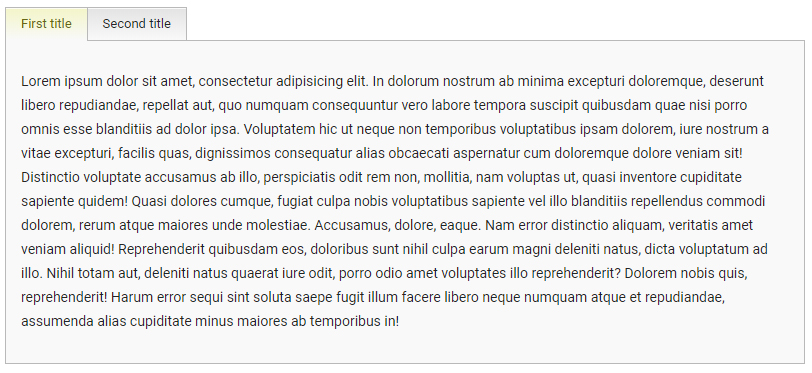

# Tab Navigator

### Settings

- **title** - text of the tab title
- **active** - makes current tab active

> active setting can be used in wrapper block as number
> or in tab block as boolean
> you can see both variants below

### How to use

	just add attribute "data-tabnav" and use settings as "data-" attributes.  

### Examples

```html

	<div class="user" data-tabnav data-active="2" >
		<div data-title="First title" data-active="true" >
			content of tab
		</div>
		<div data-title="Second title" >
			content of tab
		</div>
	</div>
	
```

### Result



-------------
Thank's for using.  
Developed by **Ustinov Maxim** - [ewclide](http://vk.com/ewclide)